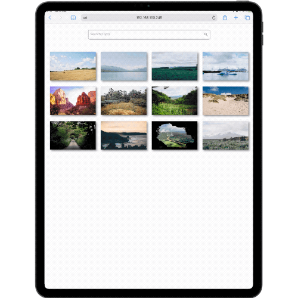

# Interactive Photo Gallery

The following project was created to train skills in vanilla JavaScript, as well as using jQuery and plug-ins.

## Purpose 

An interactive image gallery brought to life using **vanilla JavaScript** and a **jQuery Lightbox plug-in**. A **search feature** was implemented that allows the user to search the gallery.

## Skills

* JavaScript
* JSON
* jQuery Plug-In
* SASS
* CSS Grid
* CSS Flexbox
* Media Queries
* HTML

